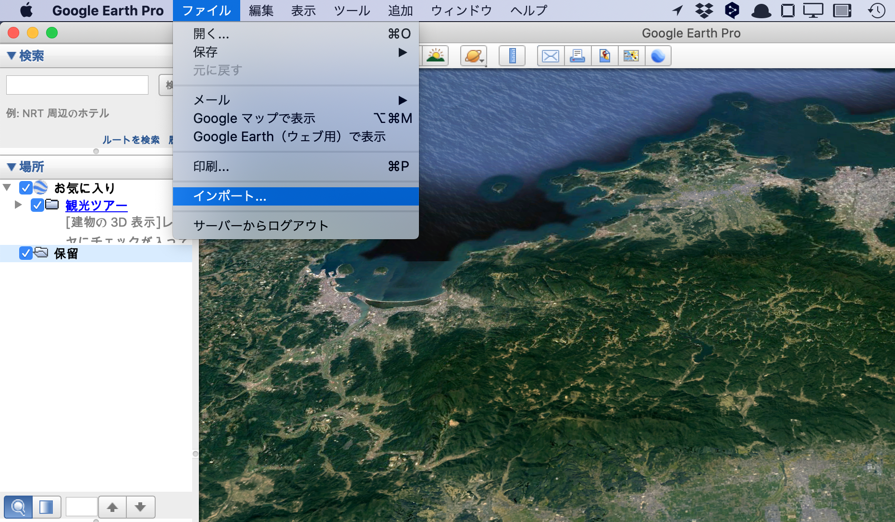
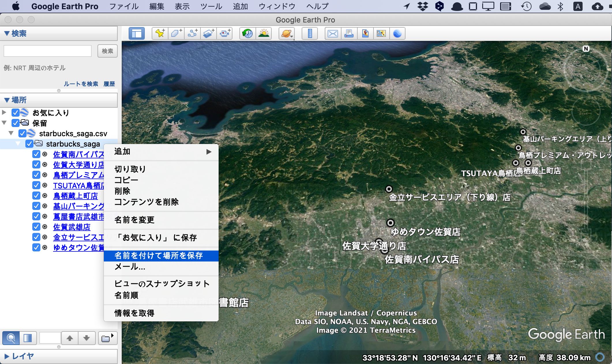
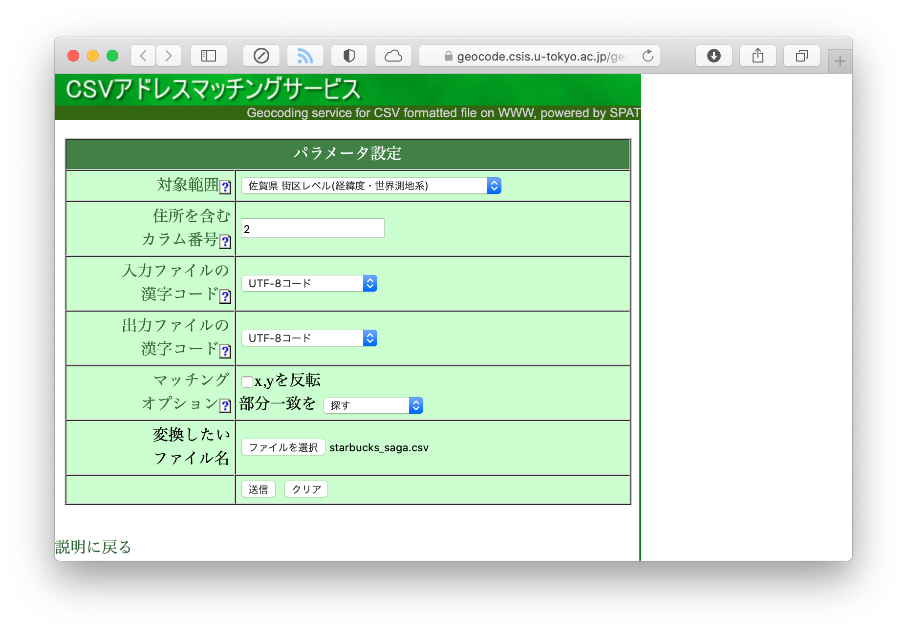

# ジオコーディング

## 概要

ジオコーディング（geocoding）とは，住所を地理的座標（すなわち緯度と経度）に変換することです。
`R`のみでジオコーディングを行うことは難しいので，
ここでは，外部のサーピスやアプリを使ってジオコーディングを行ういくつかの方法を解説します。
その結果を`R`に読み込み，GISデータとして分析に使用することを想定しています。

本章で紹介する外部サービスは，

* Google Earth Pro
* Yahoo!ジオコーダAPI
* CSVアドレスマッチングサービス（東京大学）

の3つです。

## データ

佐賀県内のスターバックス店舗の住所一覧を，[公式ウェブサイト](https://store.starbucks.co.jp/pref/saga/)から作成しました。CSVファイルを[こちら](https://gist.githubusercontent.com/kzktmr/e381b5e7d542687dcf07317c66351288/raw/0bf5bdb3a0fd0b48f873704c3971bf5726ff27f5/Starbucks_saga.csv)からダウンロードすることもできます。

```{r starbucks-data,echo=FALSE,message=FALSE}
knitr::kable(
  read_csv("data/starbucks_saga.csv")
)
```

## Google Earth Pro

[こちら](https://www.google.co.jp/intl/ja/earth/versions/#earth-pro)から，Google Earth Pro をダウンロード，インストールしてください。

Google Earth を起動しまし，「ファイル」→「インポート...」から，`starbucks_saga.csv`を読み込みます。

```{r import-csv,echo=FALSE}

```

「ファイルのインポート ウィザード」ウィンドウが開きますので，指示に従って，入力ファイルの情報を設定します。
設定が完了すると，データ読み込まれ，画面左の「場所」パネルに`starbucks_saga`と表示され，地図上にスターバックス店舗の位置がプロットされると思います。

次に，この`starbucks_saga`を右クリックし，「名前を付けて場所を保存」を選択します。
そして，ファイルを「Kml」形式で保存します。
ここでは`starbucks_saga.kml`という名前で，`data`フォルダに保存しておきましょう。

```{r export-kml,echo=FALSE}

```

ここからは，`R`での作業です。
作成したKmlファイルを，`st_read`関数で読み込みます。

```{r read-kml}
starbucks_ge <- st_read("data/starbucks_saga.kml")
head(starbucks_ge, 3)
```

`geometry`が3次元になっていますので，気になるようでしたら，`st_zm`関数でZ次元を落としておいても良いと思います。

```{r drop-z}
starbucks_ge <- st_zm(starbucks_ge)
head(starbucks_ge, 3)
```

## Yahoo!ジオコーダAPI

Yahoo Japanが提供しているAPIを使ってジオコーディングを行います。
Yahoo! JAPAN IDを持っていない人は[取得](https://account.edit.yahoo.co.jp/signup)してください。

Yahoo Japanにログインし，[こちら](https://e.developer.yahoo.co.jp/register)からアプリケーションを登録し、アプリケーションIDを発行してください（アプリケーションの種類は「クライアントサイド」にしてください）。

アプリケーションIDの管理には，`keyring`パッケージが便利です。
Windowsなら資格情報マネージャー，macosならKeychainを利用してIDやパスワードを管理することができます。
`key_set`関数を実行すると，パスワード入力欄が表示されますので，先ほど取得したアプリケーションIDを入力します。

```{r keyring}
library(keyring)
# key_set("yahoo_api")
```

まず，`starbucks_saga.csv`を読み込みましょう。

```{r read_starbucks}
starbucks <- read_csv("data/starbucks_saga.csv")
```

`R`からwebAPIを操作するには，`httr`パッケージが便利です。
`geocoidng`という関数を定義しました。

```{r new_function}
library(httr)
geocoding <- function(address){
  tmp <- GET(url = "https://map.yahooapis.jp/geocode/V1/geoCoder?",
             query = list(
               appid = keyring::key_get("yahoo_api"),
               query = address,
               output = "json"
               )
             ) # APIの結果を受け取る
  tmp <- content(tmp)
  tmp <- tmp$Feature[[1]]$Geometry$Coordinates # 緯度軽度の部分を抜き出す
  tmp <- str_split_fixed(tmp, ",", 2)          
  tmp <- as_tibble(tmp)
  tmp <- type_convert(tmp)
  tmp <- set_names(tmp, c("lon", "lat"))
  return(tmp)
}
```

定義した関数を使って，ジオコーディングを行い，緯度軽度のデータを追加します。

```{r geocoding,cache=TRUE,message=FALSE}
lonlat <- map_df(starbucks$address, geocoding)
starbucks_ya <- bind_cols(starbucks, lonlat)
```

さらに，これをSimple Featureに変換します。

```{r yahoo_sfc}
starbucks_ya <- st_as_sf(starbucks_ya, coords = c("lon", "lat"), crs = 6668)
head(starbucks_ya, 3)
```

## CSVアドレスマッチングサービス

これは，東京大学空間情報科学研究センターが提供するwebサービスで，
住所を含むcsvファイルに，緯度経度を追加して返してくれます
（詳しくは[こちら](https://geocode.csis.u-tokyo.ac.jp/home/csv-admatch/)）。

[こちら](https://geocode.csis.u-tokyo.ac.jp/geocode-cgi/geocode.cgi?action=start)のページにアクセスし，必要な情報を入力します。

```{r csv-geocoding,echo=FALSE}

```

帰ってきたファイルを，`starbucks_geocoding.csv`と名前を変えて，`data`フォルダに置きましょう。

このファイルを`R`で読み込み，あとは先ほどと同様にSimple Feature変換すれば作業終了です。

```{r ut-sfc}
starbucks_ut <- read_csv("data/starbucks_geocoding.csv")
starbucks_ut <- st_as_sf(starbucks_ut, coords = c("fX", "fY"), crs = 6668)
head(starbucks_ut, 3)
```

## 結果の図示

3通りの方法でジオコーディングした結果を全て地図に落としてみましょう。
概ね同じ位置にプロットされますが，店舗によっては利用するサービスによってジオコーディングされた座標がかなり異なるようです。
これまでの経験上，CSVアドレスマッチングサービスの精度は，他の2つと比較するとやや劣るように感じます。

```{r starbucks-map,cache=TRUE}
ggplot() + geom_sf(data = map2, fill = "white") + 
  geom_sf(data = starbucks_ge, color = "green") +
  geom_sf(data = starbucks_ya, color = "red") +
  geom_sf(data = starbucks_ut, color = "blue")
```

